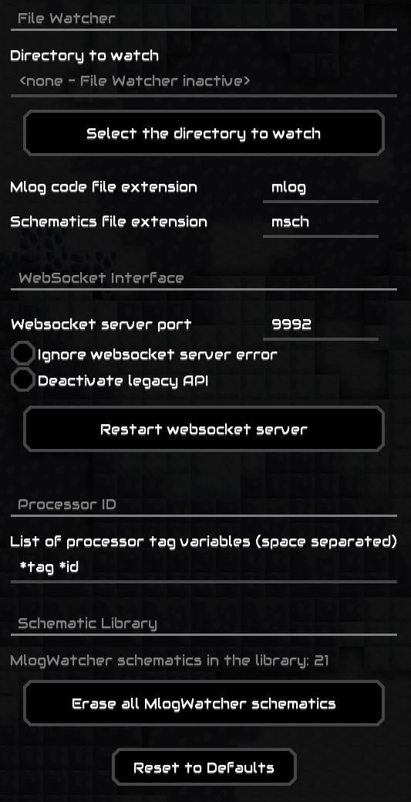

# MlogWatcher 

The Mindustry Mod for developing Mindustry Logic. This mod provides an interface for compilers and other tools to update logic processors and schematics in the game. Two basic mechanisms are supported:

* File Watcher
* WebSocket API

Additionally, when your mouse is positioned over a processor, the mod may display a tag containing the processor's description (or ID). The tag is extracted from a variable named `*tag` or `*id` (additional variables can be configured in settings). This feature is primarily meant for easy identification of processors on the map, and the processor ID should contain the name of the processor, name of the schematic it is part of (if applicable), and a version number.

Processor IDs can be created by any mlog program. [Mindcode](https://github.com/cardillan/mindcode) provides support for generating processor IDs in the expected format.

## File Watcher

The File Watcher monitors a specific directory for changes to files containing mlog code or schematic definitions.

### Mlog code

Mlog code must be stored in files having the `.mlog` extension. When such a file is created or updated in the watched directory, its content is loaded and is injected to the last tapped processor in the currently running game; the update is indicated visually on the processor. If no such processor exists, nothing happens.

To select a processor, tap on it. A golden diamond is drawn around/on a selected processor. Tapping anywhere else deselects the processor.

### Schematics

Schematic needs to be stored in binary format in files having the `.msch` extension. When such a file is created or updated in the watched directory and contains a valid schematic, the schematic is loaded, the `MlogWatcher` tag is added to the schematic, and the schematic is stored in the library. If a schematic with an identical name containing the `MlogWatcher` tag already exists in the library, it is replaced by the imported schematic. Otherwise, the imported schematic is added to the library; if a schematic with the same name already exists, the new one is placed alongside the existing one.

Schematics are updated regardless of the state of the game. When the game is running, only a message is briefly shown in the game. When the game is paused or not active at all, the imported schematic is shown on screen.

## WebSocket API

The WebSocket API is described [here](WEBSOCKET_API.md). The API provides richer functionality than the File Watcher.

The action performed on the game is decided by the client calling the API. Some of these actions require a selected processor; selecting a processor is described above. 

## Settings

The mod's configuration is available in the game menu, under Settings/Mlog Watcher:

The configuration is split into several sections.

### File Watcher

In this section, you specify the directory to watch for changed files, as well as the file extensions for the mlog files and schematic files to watch for. The path to the directory to watch can be entered either manually or by selecting a directory from the file explorer.

### WebSocket interface

In this section, you specify the port number used by the WebSocket API. Changing the number restarts the WebSocket server and makes the API immediately available on the new port.

When starting the WebSocket server fails for any reason, a message is displayed. By checking the _Ignore websocket server error_ box, the message is suppressed. A common reason for a failure is running a second instance of the game.

The WebSocket server also supports the legacy API by default. You can disable the legacy API using the _Disable legacy API_ box. It is advisable to deactivate the legacy API if you don't use any tools that rely on it.

In case of experiencing problems with the WebSocket API, the server can be forcibly restarted using the _Restart websocket server_ button. 

### Processor ID

Here a list of processor variables inspected for a processor ID or a tag may be configured. The first variable in the list, which exists in the processor and contains a String value, is used to display the tag.

### Schematic Library

In this section, the total number of schematics created by the mod is displayed. It is possible to erase all schematics created by this mod using the _Erase all MlogWatcher schematics_ button. The `MlogWatcher` tag is used to identify schematics created by this mod. 

## Demo

https://github.com/Sharlottes/MlogWatcher/assets/60801210/09305ce7-0775-45a1-9072-dd4728e5d442

## MlogJSWatchTemplate

If you are using [mlogjs](https://mlogjs.github.io/mlogjs), I recommend using [mlogJSTemplate](https://github.com/Sharlottes/mlogJsWatchTemplate) as the development environment.   
This template repository is also ready for watch mode: if you edit and save `script.ts`, it will automatically compile.   
so if you use it with this mod, you have a complete continuous development flow!
